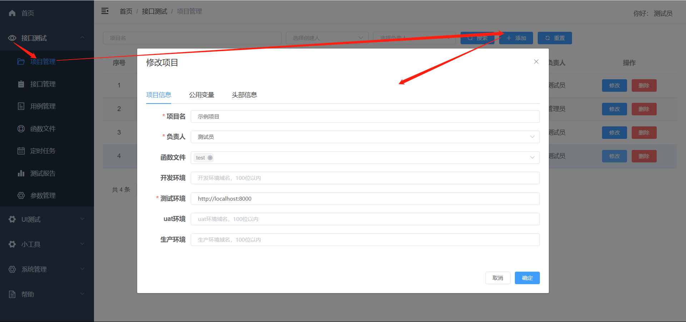
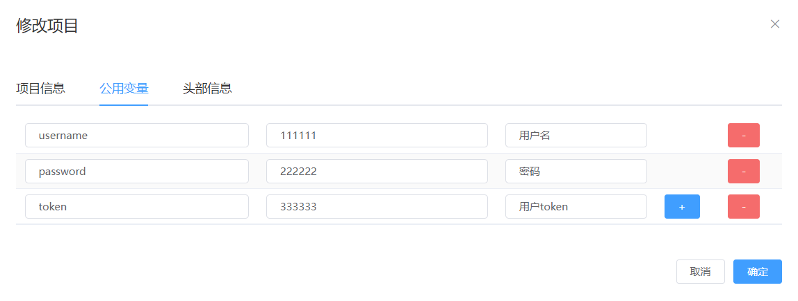
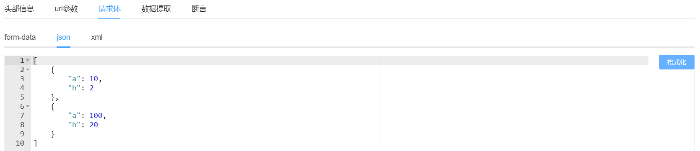
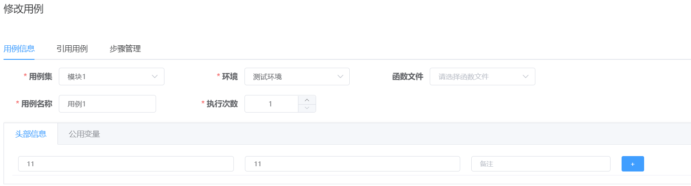
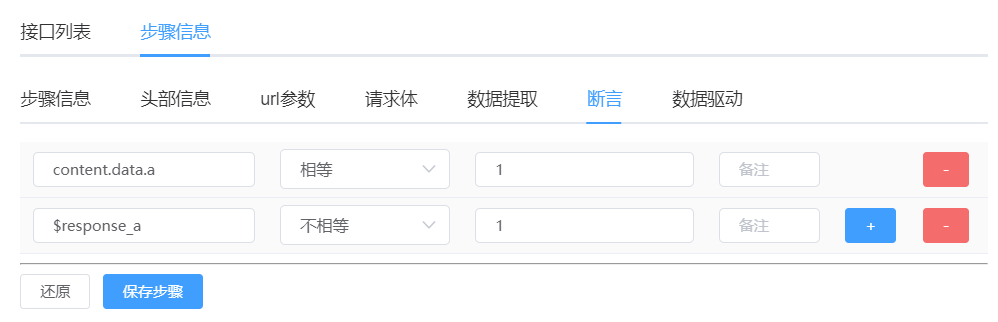
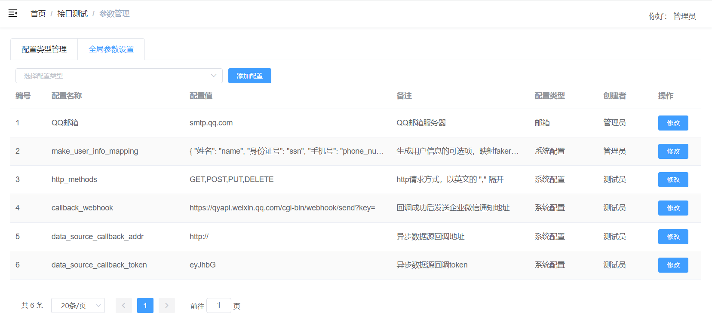

### 使用逻辑：
    项目 -> 模块 -> 接口
    用例集 -> 用例 -> 测试步骤（由接口转化而来）

### 操作流程：
    新增项目 -> 新增模块 -> 新增接口 -> 新增用例集 -> 新增测试用例 -> 添加测试步骤 -> 新增定时任务

### 操作手册

1、项目管理

  1.1、添加项目：接口测试 - 项目管理 - 添加
  >* 1.1.1、项目信息：项目名必填、负责人必选、域名必填、函数文件（见函数文件模块）非必选
  

  >* 1.1.2、公用变量：用于预设一些项目相关的固定的值，比如token，或者一些固定的账号信息（对当前项目有效）
  >  * 1.1.2.1、公用变量以 key: value 的形式存在，如以下案例，系统可以根据key（auto_test_token）获取对应的值用于后面的测试
  >  * 1.1.2.2、要使用公用变量，则使用$公用变量名即可引用，如：$auto_test_token
  >  * 1.1.2.3、“ + ”、“ - ” 可新增或删除预设的公用变量
  > 
  > 

  >* 1.1.3、头部信息：用于预设一些项目头信息的固定值，比如token、cookie、自定义鉴权字段，系统将在每次请求此项目下的任何接口的时候都在头信息中添加
  >  * 1.1.3.1、此处预设的值可以在用例、步骤处用相同的key覆盖
  >  * 1.1.3.2、“ + ”、“ - ” 可新增或删除预设的头部信息
  >  * 1.1.3.3、头部信息以 key: value 的形式存在，如以下案例，系统将在每次请求此项目下的任何接口的时候都在头信息中添加 x-auth-token: 111111111
  > 

2、模块管理

  2.1、添加模块：接口测试 - 接口管理 - 选择项目 - 添加
  

  >* 2.1.1、模块名：模块的名字，不重复即可
  >* 2.1.2、模块序号：在当前项目下，此模块的序号，后端排序的时候会用到此序号
  

  2.2、模块操作：
  >* 2.2.1、选中模块后，可以对选中的模块进行 修改、删除、置顶操作
  >* 2.2.2、选中模块后，会自动请求选中模块下的接口列表
  

3、接口管理

  3.1、添加接口：接口测试 - 接口管理 - 选择项目 - 选择模块 - 添加接口
  

  >* 3.1.1、项目信息、接口信息：
  > >* 项目信息_选择项目：在项目管理处录入的项目（自动带出、可更改）
  > >* 项目信息_模块信息：在模块管理处录入的模块（自动带出、可更改）
  > >* 项目信息_选择host：在项目管理处录入项目时录入的host信息（自动带出、可更改）
  > >* 接口信息_接口名称：接口名，不可重复
  > >* 接口信息_前置条件：在触发此接口之前要执行的操作，结合函数文件操作（在函数文件里面写好操作，在这里引用，前提是项目里面引用了此函数文件）
  > >* 接口信息_后置条件：在触发此接口之后要执行的操作，操作同上
  > >* 请求方式：目前支持选择GET、POST、PUT、DELETE，请求方式在参数管理处配置
  > >* 接口地址：接口地址，由于域名那里配置的非/结尾，所以这里要以/开头，在执行的时候才能拼接为正确的url
  > >* 调试：会保存当前设置的接口信息，并发送http请求
  
  > >* 配置请求方式：在参数管理-全局参数设置（项目初始化时会初始化此配置）
  

  >* 3.1.2、头部信息：在此处以key: value的形式设置头部信息，格式与项目级的一致
  > >* 每次触发此接口时附带发送的头部信息，当key与项目级的头部信息相同时，以此处为准
  
  
  >* 3.1.3、url参数：在此处以key: value的形式设置查询字符串参数
  > >* 每次触发此接口时附带发送的查询字符串参数
  

  >* 3.1.4、请求体：目前请求体支持form-data和json
  > >* form-data：支持字符串参数和文件参数
  > 
  > >* json：需为json格式，点右侧格式化可进行格式化
  > 
  
  >* 3.1.5、数据提取：对于当前接口响应过后，提取一些数据出来，用来断言或者参数传递都可以，此数据提取后会在内存中，运行完毕即销毁
  > >* 3.1.5.1、以key: value的形式设置，其他地方要引用此处提取的值，则直接用$key就可引用
  > >* 3.1.5.2、对于同一个接口当key重复时，会提示重复，对于不同接口key重复时，会用后运行的接口提取的值覆盖前面接口提取的值
  > >* 3.1.5.3、value提取逻辑：httprunner会将响应对象进行解析，并统一格式化，支持用jsonpath取值
  > >* 3.1.5.4、value提取逻辑：http状态码=>status_code、url=>url、cookie=>cookies、头部信息=>headers、响应体=>content、text、json  或者正确的正则表达式
  > >* 3.1.5.5、如：响应对象为json：{"code": 200, "data": {"a": 10, "b": 2 }, "msg": "处理成功"}，提取"a"的值
  
  
  >* 3.1.6、断言：接口请求完后的校验（系统暂不支持数据库校验，可用自定义函数去数据库查询后判断）
  > >* 3.1.6.1、以key: value的形式设置
  > >* 3.1.6.2、key：实际结果提取表达式，或已提取的值的引用（$已提取或已设置的key）、或正确的正则表达式（会在响应体中提取数据）
  > >* 3.1.6.3、value：必须严格区分数据类型，字符串的1则填"1"
  > >* 3.1.6.3、断言类型：目前支持：相等、不相等、包含、不包含、被包含、不被包含、转为字符串以后相等、字符串的开头、字符串的结尾、值为真、值小于、值小于等于、值大于、值大于等于、长度等于、长度大于、长度大于等于、长度小于、长度小于等于、断言数据类型、正则匹配
  

  >* 3.1.7、调试结果：调试完成后，会弹框渲染，红色为断言不通过或失败，绿色为断言通过（未设置断言信息则默认通过）
  
  
  
  

4、用例集管理

  4.1、添加用例集：接口测试 - 用例管理 - 选择项目 - 添加
  

  >* 4.1.1、名称：用例集的名字，不重复即可
  >* 4.1.2、序号：在当前项目下，此用例集的序号，后端排序的时候会用到此序号
     
  
  4.2、用例集操作：
  >* 4.2.1、选中用例集后，可以对选中的用例集进行 修改、删除、置顶操作
  >* 4.2.2、选中用例集后，会自动请求选中用例集下的用例列表
     

5、用例管理

  5.1、添加接口：接口测试 - 用例管理 - 选择项目 - 选择用例集 - 添加用例
  

  >* 5.1.1、用例信息：
  > >* 5.1.1.1、用例名称：用例名，同一用例集中，不重复即可
  > >* 5.1.1.2、执行次数：执行此用例的时候，执行多少次，默认1次
  > >* 5.1.1.3、函数文件：若是在此用例中要用到自定义辅助函数，则需要在这里引用对应的函数文件
  > >* 5.1.1.4、用例集：此用例归属于哪个用例集下，在用例集管理处录入的用例集（自动带出、可更改）
  > 

  >* 5.1.2、用例信息_头部信息：
  > >* 5.1.2.1、在此处以key: value的形式设置头部信息，格式与项目级的一致，对此用例下的所有步骤有效
  > >* 5.1.2.2、每次触发此接口时附带发送的头部信息，当key与项目级的头部信息相同时，以此处为准
  

  >* 5.1.3、用例信息_公用变量：
  > >* 5.1.3.1、用于预设一些项目相关的固定的值，比如token，或者一些固定的账号信息，对此用例下的所有步骤有效
  > >* 5.1.3.2、公用变量以 key: value 的形式存在，如以下案例，系统可以根据key（name）获取对应的值用于后面的步骤
  

  >* 5.1.4、步骤管理：把已录入的接口，转化为用例的步骤
  > >* 5.1.4.1、用例里面要执行操作的步骤很可能是需要跨项目的，这里按需引用即可
  > >* 5.1.4.2、选择项目、选择模块、在该模块下的接口列表中点击需要转化为步骤的接口行的“添加到步骤”，此时，将跳转到步骤信息
  > >* 5.1.4.3、当跳转到步骤信息时，会将已添加好的接口及其数据带过来（参数信息、断言信息、提取信息...），这里根据用例设计，修改对应的数据即可
  
  
  

  5.2、修改用例：双击要修改的用例即可
  

  5.3、复制用例：完全复制当前选中的用例，及其下面的测试步骤
  
  5.4、运行用例：用例列表点击运行用例即可
  
  >* 5.4.1、运行完用例过后，会生成测试报告，并且自动新开一个窗口，打开对应的测试报告
  

6、函数文件：自己写一些平台未提供的功能（python3），比如一些前置操作、后置操作、获取时间戳...
  >* 6.1、新建函数文件：接口测试 - 函数文件 - 新建
  >* 6.1.1、这里只需要填名字即可，在运行的时候会自动生成 名字.py 文件
  

  >* 6.2、调试函数：使用 ${函数名(参数)} 的形式来运行指定的函数
  

  >* 6.3、引用函数文件：
  > >* 6.3.1、项目管理处可引用：
  
  > >* 6.3.2、用例管理处可引用：
  
  > >* 6.3.3、引用后使用：
  

7、定时任务：定时执行测试用例

  >* 7.1、新建定时任务：接口测试 - 定时任务 - 选中项目 - 双击
  
  > >* 7.1.1、选择用例：定时任务执行时，要运行的用例
  > >* 7.1.1.1、选择项目：项目不可更改，当只选择了项目的时候，定时任务会运行当前项目下的所有用例集下的所有用例
  > >* 7.1.1.2、选择用例集：选中项目下的用例集，当只选择了用例集的时候，定时任务会运行当前用例集下的所有用例
  > >* 7.1.1.3、选择用例：定时任务执行时，要运行的用例
  
  >* 7.1.2、任务名称：随便填，同一项目下，名字不重复即可
  
  >* 7.1.3、发送报告：
  > >* 7.1.3.1、不发送：定时任务运行最后用例不管是否通过，都不发送测试报告
  > >* 7.1.3.2、始终发送：定时任务运行最后用例不管是否通过，都发送测试报告
  > >* 7.1.3.3、仅有不通过用例时发送：定时任务运行最后当有不通过的用例时，才发送测试报告
  
  >* 7.1.4、接收报告：当选择了要发送报告（始终发送、仅有不通过用例时发送）是，才展示此选项
  > >* 7.1.4.1、仅微信群：当达到发送报告的条件时，往webhook发送测试报告，支持企业微信webhook地址、钉钉群助手
  
  > >* 7.1.4.2、仅邮件：当达到发送报告的条件时，往收件邮箱发送测试报告，发件邮箱服务器在参数管理处配置，配置类型选邮箱即可
  
  
  > >* 7.1.4.3、都接收：webhook、邮件都接收
  
  >* 7.1.5、时间配置：支持cron表达式，可点击右侧 “调试cron表达式” 进行调试
  

  >* 7.2、修改任务：禁用中的任务，双击即可修改
  

  >* 7.3、修改任务状态：禁用中的任务，双击即可修改
  > >* 7.3.1、禁用中的任务，点击启用，即可修改为启用
  > >* 7.3.2、启用中的任务，点击禁用，即可修改为禁用
  > >* 7.3.3、只有启用中的任务，才会执行定时任务
  

  >* 7.4、运行任务：点击运行即可运行当前任务，会生成测试报告，并且自动新开一个窗口，打开对应的测试报告

8、测试报告：接口测试 - 测试报告 - 选中项目 - 选择报告 - 双击
  >* 8.1、双击测试报告即可查看测试报告
  

9、参数管理：接口测试 - 参数管理
  >* 9.1、配置类型管理：初始化时，会初始化配置类型，为避免误操作，新增配置类型需手动到数据库加
   
   
  >* 9.2、全局参数设置：设置对应需要的参数，初始化时会初始化一些系统的参数，如：邮箱服务器、http请求方式...
   

10、文件管理：小工具 - 文件管理
  >* 10.1、管理已上传的文件，包括测试过程中需要用到的文件，这里上传同一名字的文件即可覆盖
  

11、首页统计：点击对应的统计项，即可获得对应的明细统计，并渲染成曲线图
  
