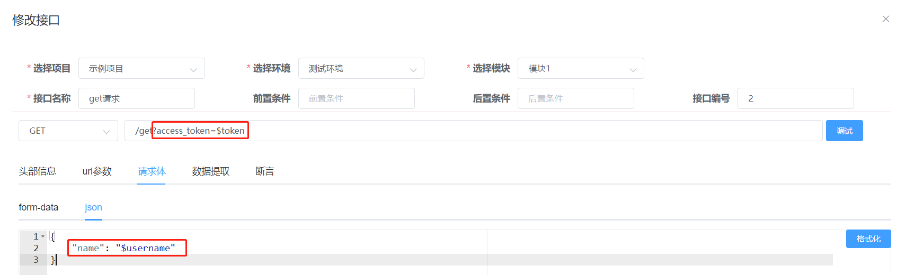
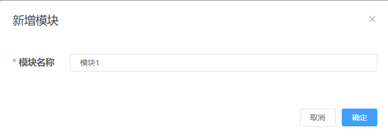
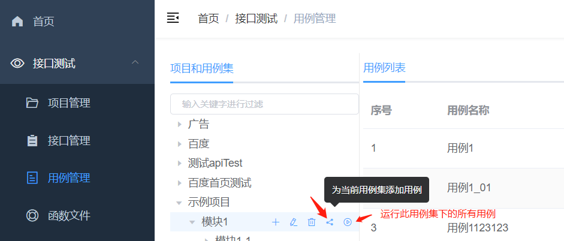
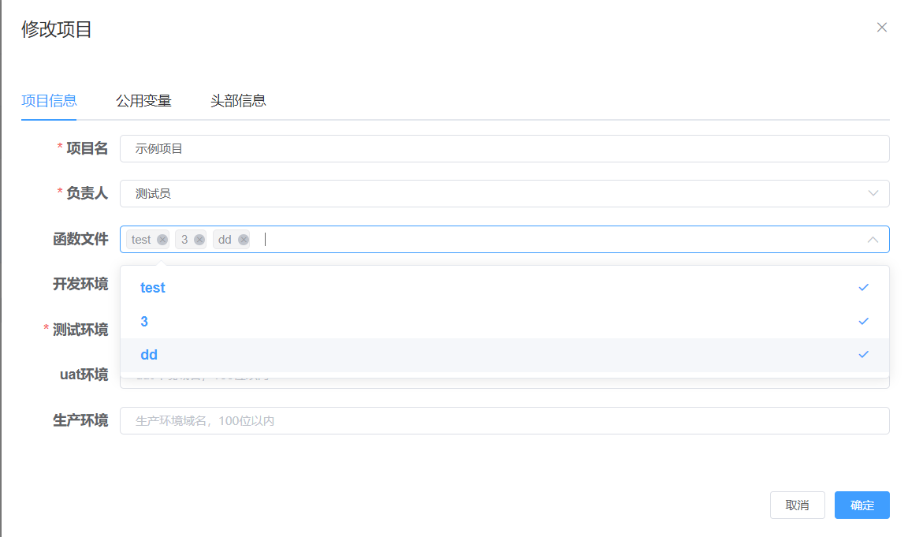

### 使用逻辑：
    接口管理：项目 -> 模块 -> 定义接口模板
    用例管理：项目 -> 模块 -> 用例 -> 测试步骤（由接口模板转化而来）

### 操作流程：
    新增项目 -> 新增模块 -> 新增接口 -> 新增测试用例 -> 添加测试步骤 -> 新增定时任务

### 操作手册

1、项目管理

  * 1.1、项目信息
    >* 1.1.1、项目名：当前项目的名字，名必填
    >* 1.1.2、负责人：必选，负责人有对当前项目下的模块、接口、用例删除的权限
    >* 1.1.3、函数文件：选择当前项目下可能用到的自定义辅助代码（详见函数文件模块），可多选、非必选
    >* 1.1.4、域名：测试环境域名必填、其他环境域名选填，当要运行接口或者用例的时候，可以选择这里设置好的环境
  

  * 1.2、公用变量
    >* 1.2.1、用于预设一些项目相关的固定的值，比如token，或者一些固定的账号信息（对当前项目有效）
    >* 1.2.2、公用变量以 key: value 的形式存在，如以下案例，系统可以根据key（username）获取对应的值用于后面的测试
    >* 1.2.3、要使用公用变量，则使用$公用变量名即可引用，如：$username
  
  

  * 1.3、头部信息
    >* 1.3.1、用于预设一些此项目固定会有的头信息，比如token、cookie、自定义鉴权字段，以 key: value 的形式存在
    >* 1.3.2、系统将在每次请求此项目下的任何接口的时候都在该请求的头信息中加入此处设置的头信息，
    >* 1.3.3、此处预设的值可以在用例、步骤处用相同的key覆盖
    >* 1.3.4、如以下案例，系统将在每次请求此项目下的任何接口的时候都在头信息中添加 x-auth-token: 111111111
  

2、模块管理

  * 2.1、添加模块：接口测试 - 接口管理 - 选择项目 - 添加
  

  * 2.2、模块名：同一节点下（项目或模块），模块的名字不重复即可
  

  * 2.3、模块操作：
  >* 2.2.1、点击项目即可获取项目下的模块
  >* 2.2.2、鼠标悬浮到模块上就会出现菜单，可以对选中的模块进行 新增、修改、删除、添加接口、从excel导入接口操作
  >* 2.2.3、选中模块后，会自动请求选中模块下的接口列表
  

3、接口管理

  * 3.1、添加接口：接口测试 - 接口管理 - 选择项目 - 选择模块 - 添加接口
  
    >* 3.1.1、选择项目：选择在项目管理处录入的项目（自动带出、可更改）
    >* 3.1.2、选择环境：选择在项目管理处录入的环境，此处选择的为接口调试时运行的环境（可更改）
    >* 3.1.3、选择模块：在模块管理处录入的模块（自动带出、可搜索、可更改）
    >* 3.1.4、接口名称：接口名，同一模块下，不重复即可
    >* 3.1.5、前置条件：在触发此接口之前要执行的操作，结合函数文件操作（在函数文件里面写好操作，在这里引用，前提是项目里面引用了此函数文件）
    >* 3.1.6、后置条件：在触发此接口之后要执行的操作，操作同上
    >* 3.1.7、请求方式：目前支持选择GET、POST、PUT、DELETE，默认为POST，请求方式在参数管理处配置
    >* 3.1.8、接口地址：由运行环境 + 此处的接口地址，拼接为请求的url
    >* 3.1.9、调试：会保存当前设置的接口信息，并发送http请求
  
    >* 3.3.11、配置请求方式：在参数管理-全局参数设置（项目初始化时会初始化此配置）
  

  * 3.2、头部信息：在此处以key: value的形式设置头部信息，格式与项目级的一致
    >* 每次触发此接口时附带发送的头部信息，当key与项目级的头部信息相同时，以此处为准
  
  
  * 3.3、url参数：在此处以key: value的形式设置查询字符串参数
    >* 每次触发此接口时附带发送的查询字符串参数
  

  * 3.4、请求体：目前请求体支持form-data、json、xml
    * 3.4.1、 form-data：支持字符串参数和文件参数
  
    * 3.4.2、json：需为json格式，点右侧格式化可进行格式化
  
    * 3.4.3、xml：xml参数
  
  
  * 3.5、数据提取：对于当前接口响应过后，提取一些数据出来，用来断言或者参数传递都可以，此数据提取后会在内存中，运行完毕即销毁
    >* 3.1.5.1、以key: value的形式设置，其他地方要引用此处提取的值，则直接用$key就可引用
    >* 3.1.5.2、对于同一个接口当key重复时，会提示重复，对于不同接口key重复时，会用后运行的接口提取的值覆盖前面接口提取的值
    >* 3.1.5.3、value提取逻辑：httprunner会将响应对象进行解析，并统一格式化，支持用jsonpath取值
    >* 3.1.5.4、value提取逻辑：http状态码=>status_code、url=>url、cookie=>cookies、头部信息=>headers、响应体=>content、text、json  或者正确的正则表达式
    >* 3.1.5.5、如：响应对象为json：{"code": 200, "data": [{"a": 10}, {"b": 2}], "msg": "处理成功"}，提取"a"的值
  
  
  * 3.6、断言：接口请求完后的校验（系统暂不支持直接对数据库校验，可用自定义函数去数据库查询对应数据然后在此处做断言）
    >* 3.6.1、以key: value的形式设置
    >* 3.6.2、key：实际结果提取表达式，或已提取的值的引用（$已提取或已设置的key）、或正确的正则表达式（会在响应体中提取数据）
    >* 3.6.3、value：必须严格区分数据类型，字符串的1则填"1"
    >* 3.6.4、断言类型：目前支持：相等、json相等（包括元素的位置）、契约校验、不相等、包含、不包含、被包含、不被包含、转为字符串以后相等、字符串的开头、字符串的结尾、值为真、值小于、值小于等于、值大于、值大于等于、长度等于、长度大于、长度大于等于、长度小于、长度小于等于、断言数据类型、正则匹配
  

  * 3.7、调试结果：调试完成后，会新开页面展示测试报告，红色为断言不通过或失败，绿色为断言通过（未设置断言信息则默认通过）
  
  
  

  * 3.8、拖拽排序：可拖拽进行排序
  

4、用例管理

  * 4.1、添加用例：接口测试 - 用例管理 - 选择项目 - 选择模块 - 添加用例
  

  * 4.2、用例信息：
    >* 4.2.1、模块：此用例归属于哪个模块下，在模块管理处录入的模块（自动带出、可更改）
    >* 4.2.2、环境：用例运行时的环境，若此条用例下的步骤为多个项目下的接口，用例这里选择了uat环境，那么需人为保证这些项目的uat域名都已设置
    >* 4.2.3、函数文件：若是在此用例中要用到自定义辅助函数，则需要在这里引用对应的函数文件
    >* 4.2.4、用例名称：用例名，同一用例集中，不重复即可
    >* 4.2.5、执行次数：执行此用例的时候，执行多少次，默认1次
  

  * 4.3、头部信息：
    >* 4.3.1、在此处以key: value的形式设置头部信息，格式与项目级的一致，对此用例下的所有步骤有效
    >* 4.3.2、每次触发此接口时附带发送的头部信息，当key与项目级的头部信息相同时，以此处为准
  

  * 4.4、公用变量：
    >* 4.4.1、用于预设一些项目相关的固定的值，比如token，或者一些固定的账号信息，对此用例下的所有步骤有效
    >* 4.4.2、公用变量以 key: value 的形式存在，如以下案例，系统可以根据key（name）获取对应的值用于后面的步骤
    >* 4.4.3、当key与项目级的公用变量相同时，以此处为准
  

  * 4.5、引用用例：
    * 4.5.1、引用已存在的用例、如登录、或者当前用例需要用到的前置条件或者后置条件，次用例就只需要关注测试点即可
  

  * 4.6、步骤管理：把已录入的接口，转化为用例的步骤
    * 4.6.1、用例里面要执行操作的步骤很可能是需要跨项目的，这里按需引用即可
    * 4.6.2、选择项目、选择模块、在该模块下的接口列表中点击需要转化为步骤的接口行的“添加到步骤”，此时，将跳转到步骤信息
    * 4.6.3、当跳转到步骤信息时，会将已添加好的接口及其数据带过来（参数信息、断言信息、提取信息...），这里根据用例设计，修改对应的数据即可
  
  
  
    * 4.6.4、数据驱动，列表里面的每一个字典为一个请求的参数，_comment参数为用例描述，不会参与到传参中，会加到步骤名后面
    * 4.6.5、当请求方法为get时，参数默认传查询字符串参数，当请求方法为非get请求时，参数默认为json
  

  * 4.6、复制用例：完全复制当前选中的用例，及其下面的测试步骤
  
  
  * 4.7、拖拽排序：用例可继续拖拽排序
  

  * 4.8、运行用例：用例列表点击运行用例即可，运行完用例过后，会生成测试报告，并且自动新开一个窗口，打开对应的测试报告
  
  

5、函数文件：自己写一些平台未提供的功能（python3），比如一些前置操作、后置操作、数据库查询、获取时间戳...
  * 5.1、新建函数文件：接口测试 - 函数文件 - 新建
    >* 5.1.1、这里只需要填名字即可，在运行的时候会自动生成 名字.py 文件
  
    >* 5.1.2、调试函数：使用 ${函数名(参数)} 的形式来运行指定的函数
  

  * 5.2、引用函数文件：
    >* 5.2.1、项目管理处可引用：
  
    >* 5.2.2、用例管理处可引用：
  
    >* 5.2.3、引用后使用：
  

6、定时任务：定时执行测试用例

  * 6.1、新建定时任务：接口测试 - 定时任务 - 选中项目 - 添加定时任务
  
  
    >* 6.1.1、选择项目：项目不可更改，当只选择了项目的时候，定时任务会运行当前项目下的所有模块下的所有用例
    >* 6.1.2、选择环境：当前定时任务运行的环境，dev、测试环境、uat、生产
    >* 6.1.3、选择模块：选中项目下的模块（可多选），当只选择了模块的时候，定时任务会顺序运行所选模块下的所有用例
    >* 6.1.4、选择用例：定时任务执行时，要运行的用例（可多选）
    >* 6.1.5、任务名称：随便填，同一项目下，名字不重复即可
  

  * 6.2、发送报告：
    >* 6.2.1、不发送：定时任务运行最后用例不管是否通过，都不发送测试报告
    >* 6.2.2、始终发送：定时任务运行最后用例不管是否通过，都发送测试报告
    >* 6.2.3、仅有不通过用例时发送：定时任务运行最后当有不通过的用例时，才发送测试报告
  
  
  * 6.3、接收报告：
    >* 6.3.1、当选择了要发送报告是（始终发送、仅有不通过用例时发送），才展示此选项
    >* 6.3.2、仅微信群：当达到发送报告的条件时，往企业微信群发送测试报告
  
    >* 6.3.3、仅钉钉群：当达到发送报告的条件时，当达到发送报告的条件时，往钉钉群发送测试报告
  
    >* 6.3.4、仅邮件：当达到发送报告的条件时，往收件邮箱发送测试报告，发件邮箱服务器在参数管理处配置，配置类型选邮箱即可
  
  
    >* 6.3.5、都接收：企业微信、钉钉、邮件都接收
  
  
  * 6.4、时间配置：支持cron表达式，可点击右侧 “调试cron表达式” 进行调试
  

  * 6.5、修改任务：只有状态为禁用中的任务，才可修改
  

  * 6.6、修改任务状态
    >* 6.6.1、禁用中的任务，点击启用，即可修改为启用
    >* 6.6.2、启用中的任务，点击禁用，即可修改为禁用
    >* 6.6.3、只有启用中的任务，才会执行定时任务
  

  * 6.7、运行任务：点击运行即可运行当前任务，会生成测试报告，并且自动新开一个窗口，打开对应的测试报告
  
 
8、测试报告：接口测试 - 测试报告 - 选中项目 - 选择报告 - 查看
  * 8.1、点击查看测试报告即可打开新窗口查看测试报告
  

9、参数管理：接口测试 - 参数管理
  * 9.1、配置类型管理：初始化时，会初始化配置类型，暂未开放功能界面，新增配置类型需手动到数据库加
   
   
  * 9.2、全局参数设置：设置对应需要的参数，初始化时会初始化一些系统的参数，如：邮箱服务器、http请求方式...，为避免误操作，新增/修改需管理员角色才能操作
   
    
10、文件管理：小工具 - 文件管理
  >* 10.1、管理已上传的文件，包括测试过程中需要用到的文件，这里上传同一名字的文件即可覆盖
  

11、首页统计：点击对应的统计项，即可获得对应的明细统计，并渲染成曲线图
  
